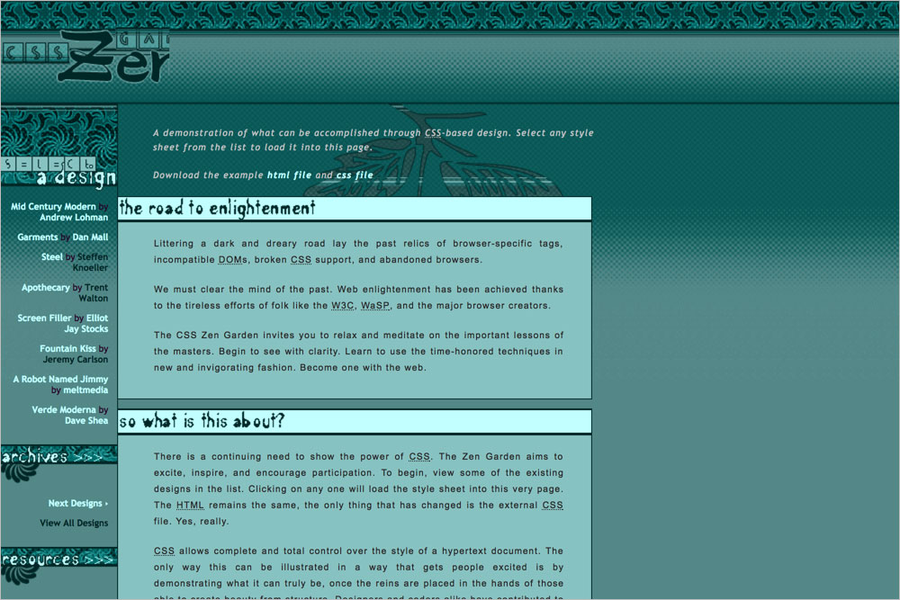
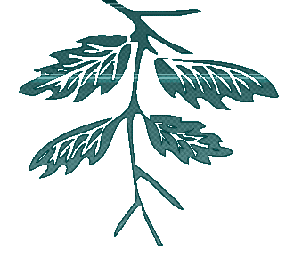
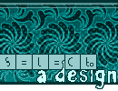

# 022 Viridity

## Background images
**`body`** `z_bgrnd.gif`  

**`.intro header`** `zh1_combo.gif`  

**`.page-wrapper`** `z_cont.gif`  

**`.intro .preamble h3`** `h3_preamble.gif`  

**`.supporting`** `z_twig.gif`  

**`.supporting .explanation h3`** `h3_support1.gif`  

**`.supporting .participation h3`** 
`h3_support2.gif`  

**`.supporting .benefits h3`** 
`h3_support3.gif`  

**`.supporting .requirements h3`** `h3_support4.gif`  

**`.supporting footer`** `z_trim.png`  

**`.sidebar .design-selection h3`** `zh3_select.gif`  

**`.sidebar .design-archives h3`** `zh3_arch.gif`  

**`.sidebar .zen-resources h3`** `zh3_res.gif`  
