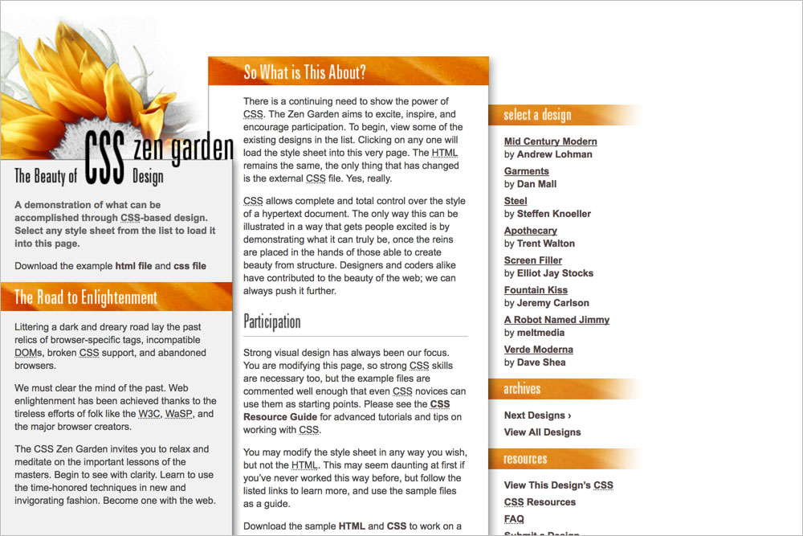
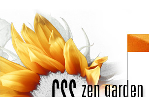

# 026 Zunflower

## Background images
**`body`** `bg_left.gif`  

**`.intro header h1`** `h1.jpg`  

**`.intro header h2`** `h2.gif`  

**`.intro .preamble h3`** `the_road.jpg`  

**`.supporting`** `support_bg.gif`  

**`.supporting .explanation`** `so_what_bg.gif`  

**`.supporting .explanation h3`** `so_what.jpg`  

**`.supporting .participation h3`** `parti.gif`  

**`.supporting .benefits h3`** `bene.gif`  

**`.supporting .requirements h3`** `req.gif`  

**`.supporting .footer`** `foot.jpg`  

**`.sidebar .design-selection h3`** `select.jpg`  

**`.sidebar  .design-archives h3`** `archives.jpg`  

**`.sidebar .zen-resources h3`** `resources.jpg`  

