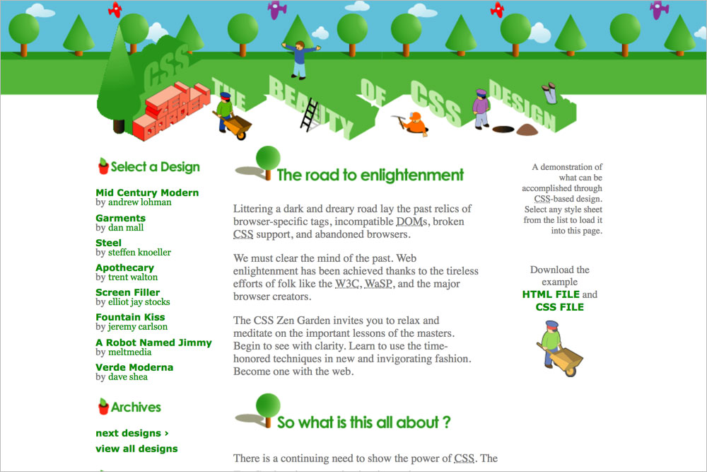
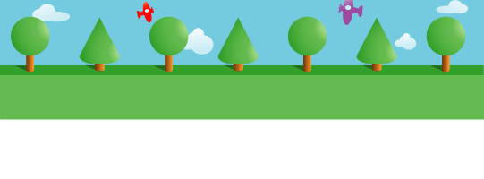
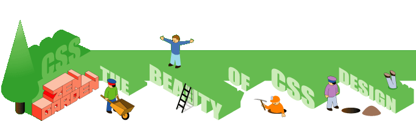

# 031 Hedges

## Background images

**`body`** `bg_tree.gif`  

**`.intro header`** `nutitle.gif`  

**`.intro .summary p:last-child`** `barrow.gif`  

**`.intro .preamble h3`** `road.gif`  

**`.supporting .explanation h3`** `what.gif`  

**`.supporting .participation h3`** `participation.gif`  

**`.supporting .benefits h3`** `benefits.gif`  

**`.supporting .requirements h3`** `requirements.gif`  

**`.sidebar .design-selection h3`** `select.gif`  

**`.sidebar .design-archives h3`** `archives.gif`  

**`.sidebar .zen-resources h3`** `resources.gif`  

