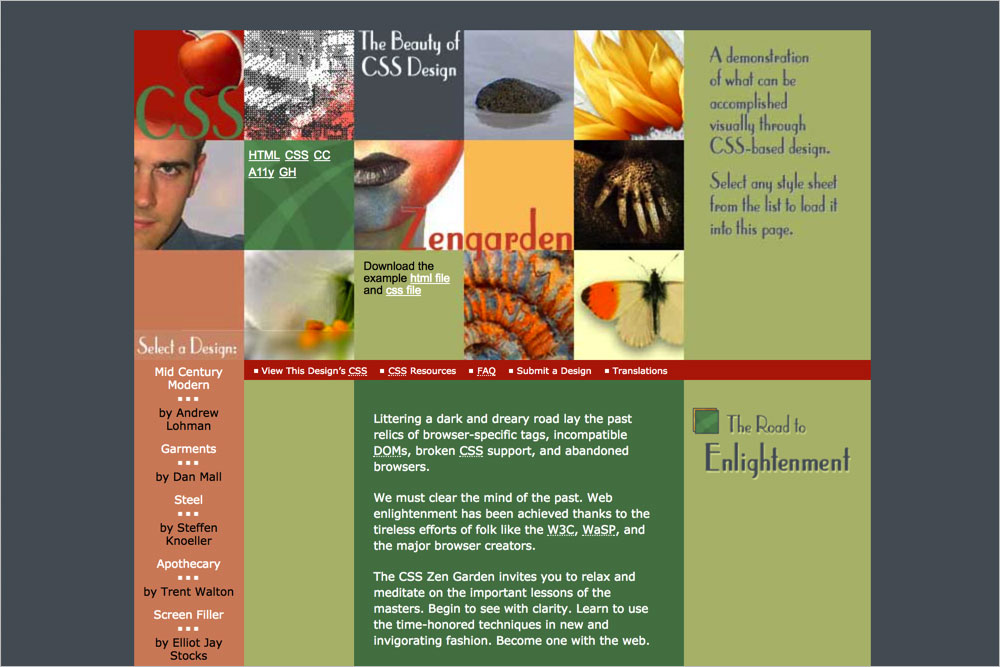
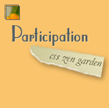
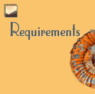

# 050 First Summary

## Background images

**`.intro header`** `zengarden.jpg`  

**`.intro .preamble`** `enlightenment_default.gif`  

**`.supporting .explanation`** `about.gif`  

**`.supporting .participation`** `participation.gif`  

**`.supporting .benefits`** `benefits.gif`  

**`.supporting .requirements`** `requirements.gif`  

**`.sidebar .design-selection a.design-name`** `punkte.gif`  

**`.sidebar .design-selection a.design-name:hover`** `anim.gif`  

**`.sidebar .design-archives h3`** `archives3.gif`  

**`.sidebar .design-archives a`** **`.sidebar .zen-resources a`** `point.gif`  

**`.sidebar .zen-resources a:hover`** `pointanim.gif`  

