# 068 Ballade
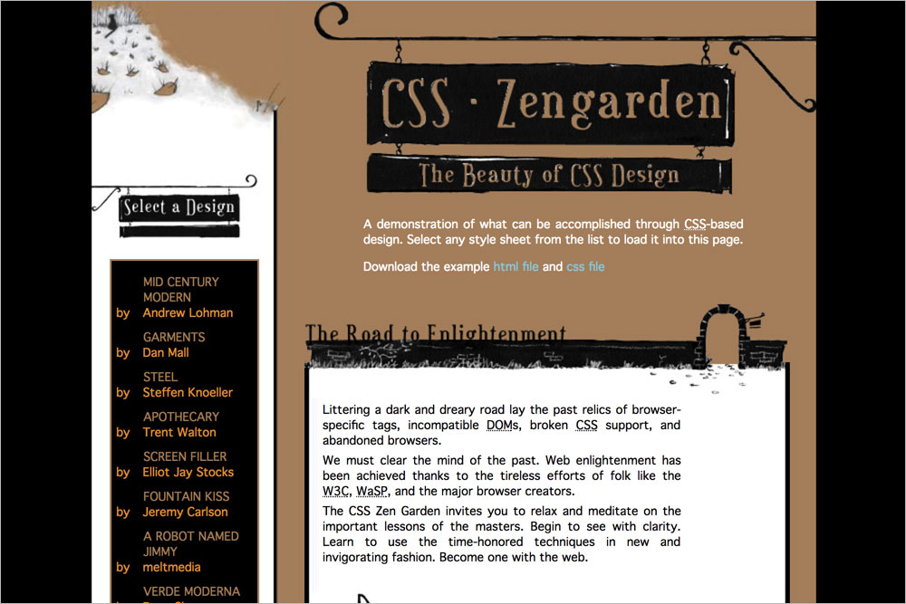

## Background images
**`.page-wrapper`** `fond.jpg`  

**`.page-wrapper::after`** `bas.jpg`  
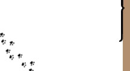

**`.intro header`** `zen.jpg`  
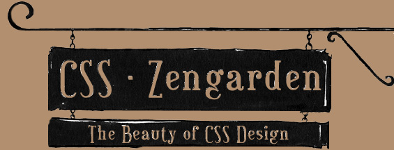

**`.intro .preamble`** `fond1.jpg`  

**`.intro .preamble h3`** `road.jpg`  
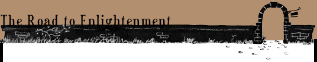

**`.supporting .explanation`** `fond2.jpg`  

**`.supporting .explanation h3`** `about.jpg`  
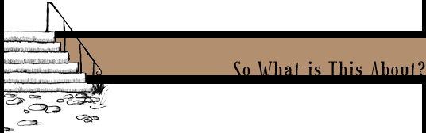

**`.supporting .participation`** `fond3.jpg`  

**`.supporting .participation h3`** `particip.jpg`  
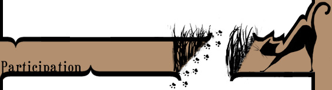

**`.supporting .benefits`** `fond4.jpg`  

**`.supporting .benefits h3`** `benef.jpg`  
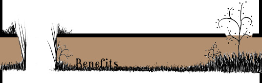

**`.supporting .requirements`** `fond5.jpg`  

**`.supporting .requirements h3`** `req.jpg`  
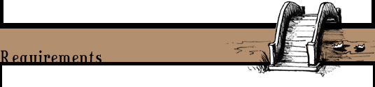

**`.supporting footer`** `fin.jpg`  
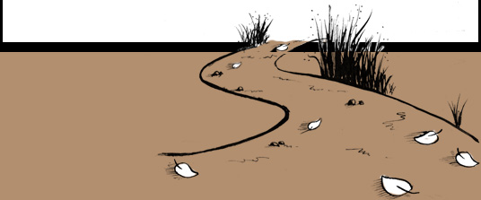

**`.sidebar`** `chat.jpg`  
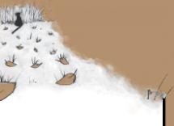

**`.sidebar .design-selection h3`** `select.jpg`  

**`.sidebar .design-archives h3`** `archiv.jpg`  
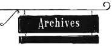

**`.sidebar .zen-resources h3`** `resou.jpg`  
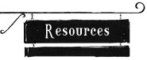

**`.sidebar .design-selection a.design-name:hover`** `puce.jpg`  

**`.sidebar .design-archives a:hover`** `puceherbe.jpg`  

**`.sidebar .zen-resources a:hover`** `puceparenth.jpg`  
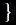
