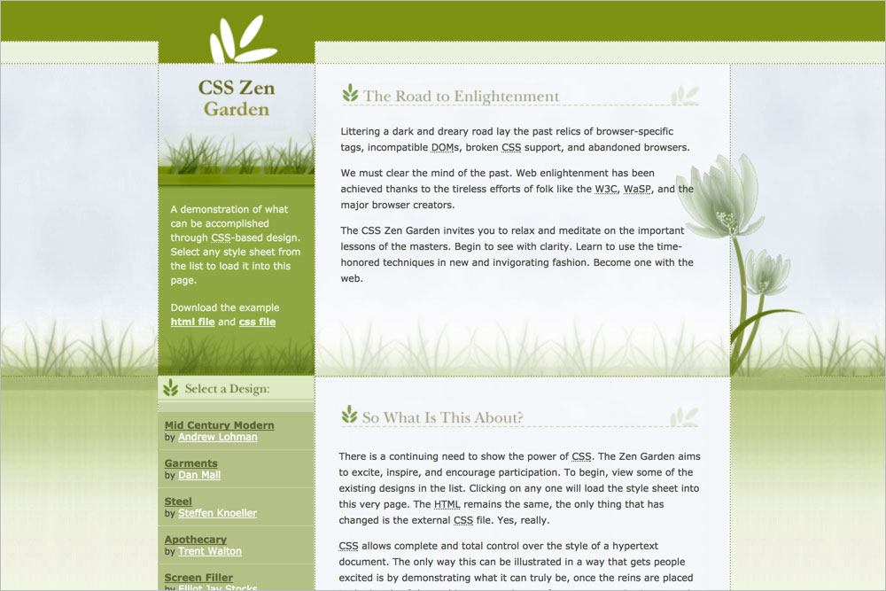
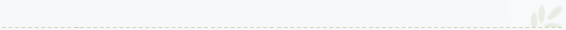

# 083 Springtime

## Background images
**`body`** `bg.jpg`  

**`.page-wrapper`** `whitebg2.gif`  

**`.page-wrapper::after`** `flwr.gif`  

**`.intro header h1`** `head.gif`  

**`.intro .summary`** `green.gif`  

**`.intro .preamble`** `whitebg.gif`  

**`.intro .preamble h3`** `pretext.gif`  

**`.supporting .explanation h3`** `whatistext.gif`  

**`.supporting .participation h3`** `parttext.gif`  

**`.supporting .benefits h3`** `beneftxt.gif`  

**`.supporting .requirements h3`** `reqtext.gif`  

**`.supporting footer`** `notext.gif`  

**`.sidebar`** `greenbg.gif`  

**`.sidebar .wrapper`** `fade.gif`  

**`.sidebar .design-selection h3`** `seltxt.gif`  

**`.sidebar .design-archives h3`** `archtxt.gif`  

**`.sidebar .zen-resources h3`** `restxt.gif`  

