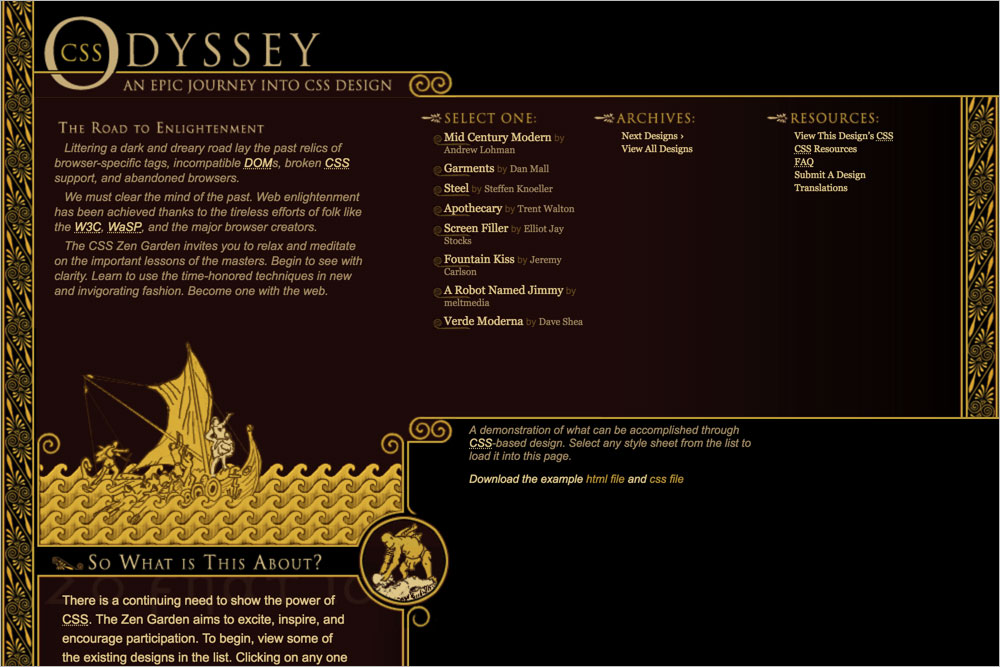
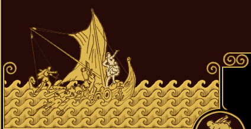

# 103 Odyssey

## Background images

**`body`** `ody-bg3.jpg`  

**`.intro`** `intro-bg.gif`  

**`.intro header`** `title2.gif`  

**`.intro .preamble`** `preamb2.gif`  

**`.intro .preamble h3`** `preamb_title.gif`  

**`.supporting .explanation h3`** `hd-explain.gif`  

**`.supporting .participation h3`** `hd-partic.gif`  

**`.supporting .benefits h3`** `hd-benefits.gif`  

**`.supporting .requirements h3`** `hd-require.gif`  

**`.supporting footer`** `footer.gif`  

**`.sidebar`** `list-bg.gif`  

**`.sidebar .design-selection h3`** `select.gif`  

**`.sidebar .design-archives h3`** `archives.gif`  

**`.sidebar .zen-resources h3`** `resources.gif`  

**`.sidebar .design-selection li`** `bullet.gif`  

