# 148 Museum
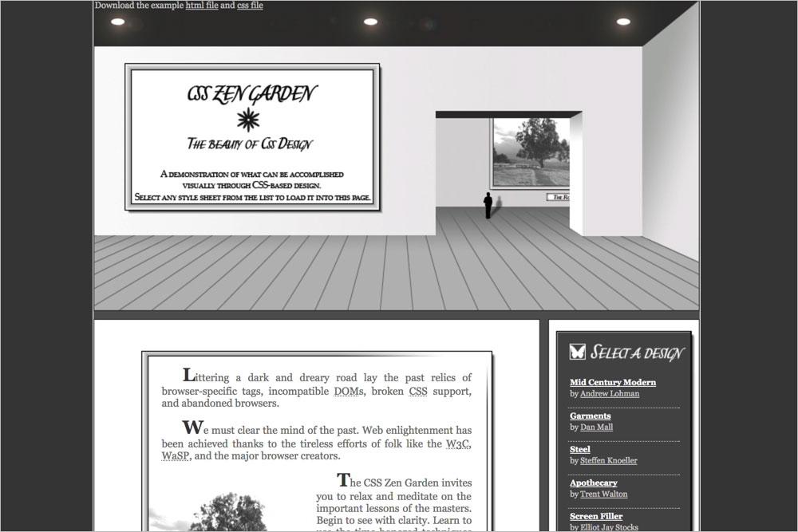

## Background images

**`.intro header`** `header_bg.jpg`  
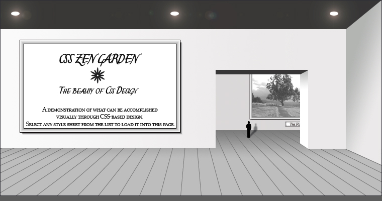

**`.intro .preamble`** `intro_bg.jpg`  

**`.intro .preamble h3`** `preamble.jpg`  

**`.intro .preamble p:nth-child(2)`** `preamble_bg.jpg`  
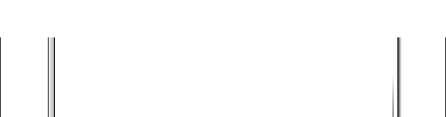

**`.intro .preamble p:last-child`** `preamble_img.jpg`  
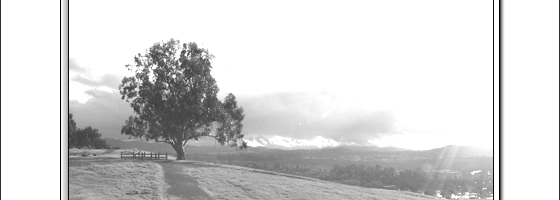

**`.supporting`** `st_bg.jpg`  

**`.supporting .explanation`** `explanation_bg.jpg`  

**`.supporting .explanation h3`** `trans_prea_expl.jpg`  
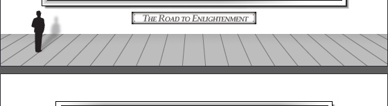

**`.supporting .explanation p:last-child`** `explanation_img.jpg`  
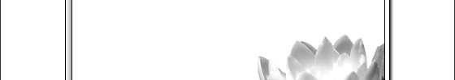

**`.supporting .participation`** `participation_bg.jpg`  

**`.supporting .participation h3`** `trans_expl_part.jpg`  
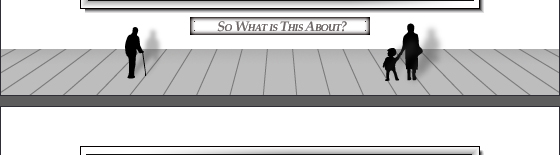

**`.supporting .participation p:last-child`** `participation_img.jpg`  
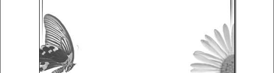

**`.supporting .benefits`** `benefits_bg.jpg`  

**`.supporting .benefits h3`** `trans_part_bene.jpg`  
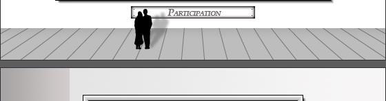

**`.supporting .requirements`** `requirements.jpg`  
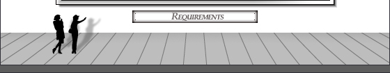

**`.supporting .requirements h3`** `trans_bene_requ.jpg`  
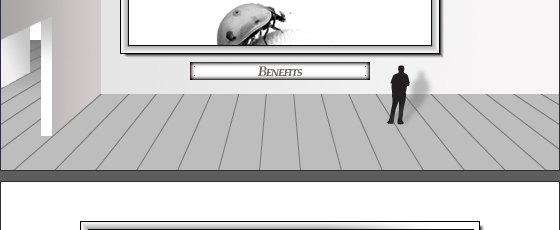

**`.supporting .requirements p:nth-child(2)`** `requirements_img.jpg`  
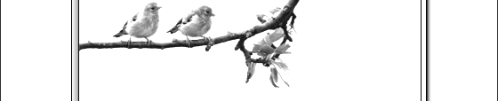

**`.supporting footer`** `footer_bg.jpg`  

**`.sidebar .wrapper>div`** `linklist_footer.jpg`  
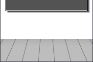

**`.sidebar .wrapper .zen-resources`** `linklist_footer_guard.jpg`  
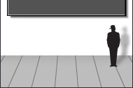

**`.sidebar .design-selection h3`** `header_lselect.jpg`  

**`.sidebar .design-archives h3`** `header_larchives.jpg`  

**`.sidebar .zen-resources h3`** `header_lresources.jpg`  

**`.sidebar ul`** `linklist_bg.jpg`  

