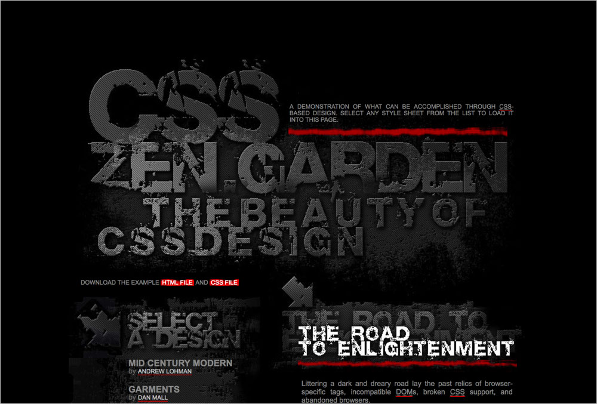

# 198 The Original

## Background images

**`body`** `background.jpg`  

**`a`** `a_link.jpg`  

**`.intro header`** `css_zen.jpg`  

**`.intro .preamble h3`** `preamble.jpg`  

**`.supporting .explanation h3`** `supportingText.jpg`  

**`.supporting .participation h3`** `participation.jpg`  

**`.supporting .benefits h3`** `benefits.jpg`  

**`.supporting .requirements h3`** `requirements.jpg`  

**`.sidebar`** `original.jpg`  

**`.sidebar .wrapper`** `linkList.jpg`  

**`.sidebar .design-selection h3`** `selectAdesign.jpg`   

**`.sidebar .design-archives h3`** `archives.jpg`  

**`.sidebar .zen-resources h3`** `resources.jpg`  

