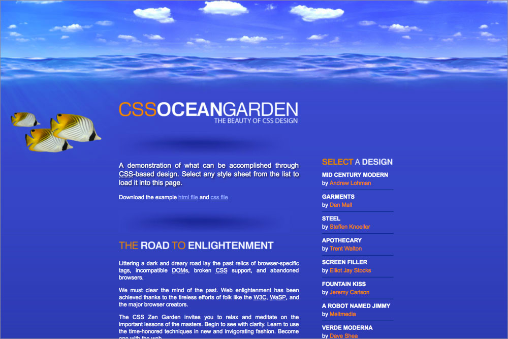
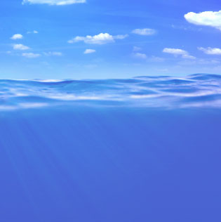
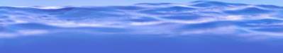
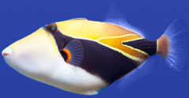
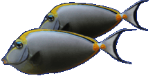
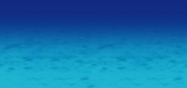

# 210 OceanScape

## Background images

**`body`** `gradient_bg.jpg`  

**`body::before`** `fish_top.gif`  

**`body::before`** `sunlight.jpg`  

**`body::before`** `clouds.jpg`  

**`body::before`** `water_edge.jpg`  

**`body::before`** `fish01.jpg`  

**`body::after`** `fish_bottom.gif`  

**`body::after`** `seafloor.jpg`  

**`body::after`** `seafloor_bg.jpg`  

**`.intro header h1`** `h1.gif`  

**`.intro header h2`** `h2.gif`  

**`.intro .summary`** `divider01.jpg`  

**`.intro .preamble`** `divider02.jpg`  

**`.intro .preamble h3`** `h3_road.gif`  

**`.supporting .explanation`** `divider03.jpg`  

**`.supporting .explanation h3`** `h3_about.gif`  

**`.supporting .participation`** `divider04.jpg`  

**`.supporting .participation h3`** `h3_participation.gif`  

**`.supporting .beneftis`** `divider05.jpg`  

**`.supporting .beneftis h3`** `h3_benefits.gif`  

**`.supporting .requirements`** `divider06.jpg`  

**`.supporting .requirements h3`** `h3_requirements.gif`  

**`.sidebar .design-selection h3`** `h3_select.gif`  

**`.sidebar .design-archives h3`** `h3_archives.gif`  

**`.sidebar .zen-resources h3`** `h3_resources.gif`  

