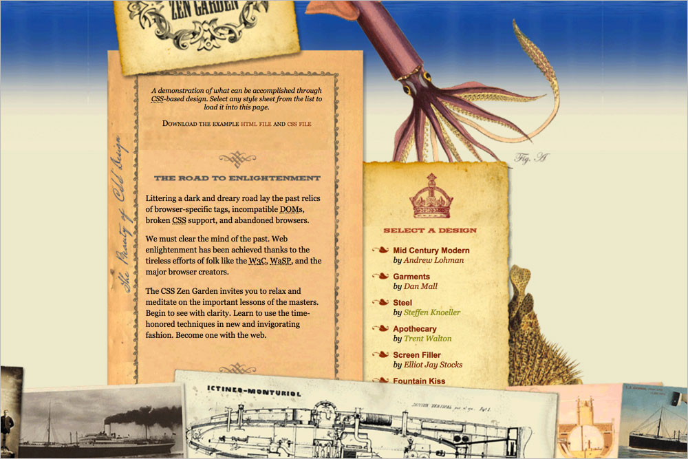
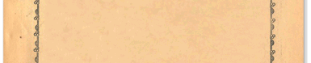
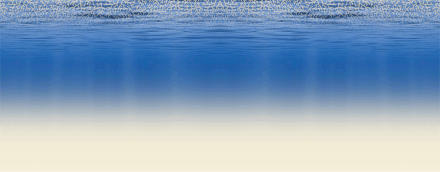
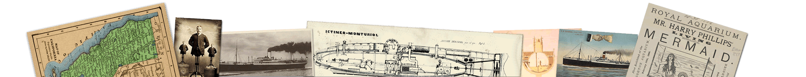
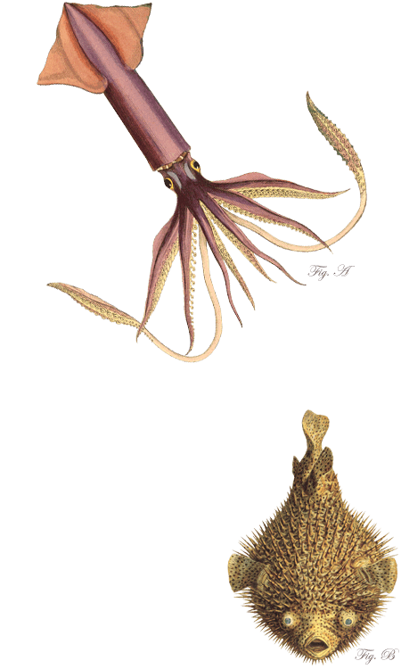
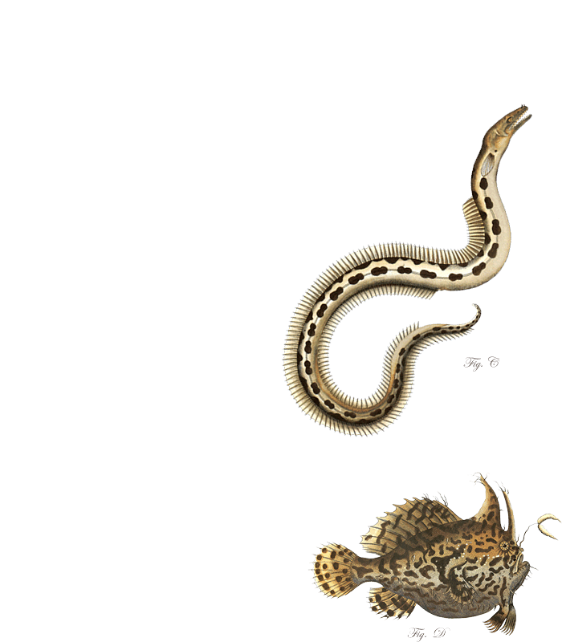
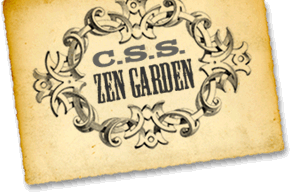
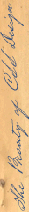
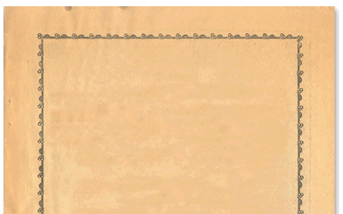
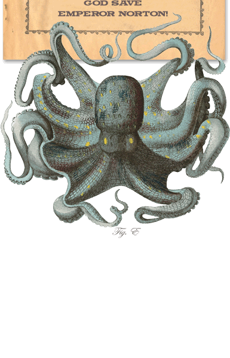

# 213 Under the Seal

## Background images

**`.intro .summary`** **`.intro .preamble`** **`.supporting > div`** `back.png`  

**`body`** `water.png`  

**`body::after`** `bottom.png`  

**`.page-wrapper`** `squid-blowfish.png`  

**`.page-wrapper::after`** `critters.png`  

**`.intro header h1`** `title.png`  

**`.intro header h2`** `beauty.png`  

**`.intro .summary`** `top.png`  

**`.intro .preamble h3`** `enlightenment.png`  

**`.supporting::after`** `end.png`  

**`.supporting .explanation h3`** `about.png`  

**`.supporting .participation h3`** `participation.png`  

**`.supporting .benefits h3`** `benefits.png`  

**`.supporting .requirements h3`** `requirements.png`  

**`.supporting .requirements p:last-child`** `huzzah.png`  

**`.supporting footer`** `footer.png`  

**`.sidebar::before`** `menu-top.png`  

**`.sidebar::after`** `menu-end.png`  

**`.sidebar li`** `bullet.png`  

**`.sidebar .wrapper > div`** `menu-back.png`  

**`.sidebar .design-selection h3`** `select.png`  

**`.sidebar .design-archives h3`** `archives.png`  

**`.sidebar .zen-resources h3`** `resources.png`  

